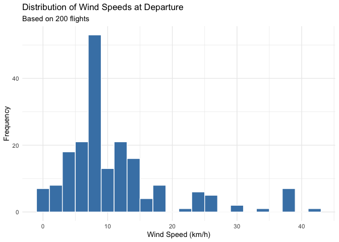

# Airline Performance Dashboard & Delay Prediction System
Sabuhi Abbasov

## Overview

This project is an interactive, real-time airline performance dashboard that monitors and predicts flight delays across various carriers. By combining a Python-based data engineering backend with an R Shiny frontend, the application provides a live "leaderboard" and comparative analysis of airline reliability. 

Users can select specific airline companies to view their current performance metrics, which are benchmarked against global averages to determine real-time efficiency. The project concludes with a machine learning model that estimates potential delay durations based on historical patterns, flight schedules, and carrier-specific performance data.

## Technical Requirements

### 1. Data Pipeline (Python)

**API Orchestration:** Implement a robust fetching mechanism for the Aviation Stack API with built-in pagination to handle large datasets and rate-limiting to respect API constraints.

**Data Transformation:** Use the pandas library to flatten deeply nested JSON responses (specifically the departure, arrival, and airline objects) into a clean, tabular CSV format.

**Local Caching:** Maintain a toggleable caching system that allows the application to run on saved data during development while switching to live API calls for final presentations.

### 2. Frontend & Analytics (R & Shiny)

**Interactive Dashboard:** Build a Shiny application with a ui (User Interface) for dynamic airline selection and a server logic to filter and process data on the fly.

**Time-Series Engineering:** Use the lubridate package to extract temporal features such as "Hour of Day" and "Day of Week" to identify peak delay periods.

**Advanced Visualization:** Utilize ggplot2 or plotly to generate interactive distributions of delay frequencies and airline reliability rankings.

### 3. Machine Learning & Modeling (R)

**Predictive Analysis:** Develop a supervised learning model (e.g., Linear Regression or Random Forest) using the tidymodels framework to predict delay minutes.

**Feature Encoding:** Implement categorical encoding for non-numeric variables like airline_name and departure_iata to make them compatible with mathematical models.

**Model Evaluation:** Calculate performance metrics, specifically RMSE (Root Mean Square Error), to quantify the accuracy of the predicted estimates against actual recorded delays.

## Sample Analysis

<!-- To render README: quarto render analysis.qmd --to gfm -->



    # A tibble: 6 × 3
      departure_iata avg_wind flight_count
      <chr>             <dbl>        <int>
    1 BPX               38.5             7
    2 TFU               13.2            15
    3 SIN               12.8            13
    4 CDG                8.85           11
    5 CKG                8.79           10
    6 MEL                8.54           12

## Python

``` python
import pandas as pd
from pathlib import Path

data_path = Path("data/cleaned/flights_with_weather.csv")

py_flights = pd.read_csv(data_path)
```

## R

``` r
flights_from_python <- py$py_flights
```

``` r
library(lubridate)

flights_from_python <- flights_from_python |>
  mutate(
    dep_time_clean = as_datetime(departure_estimated),
    hour_of_day = hour(dep_time_clean),
    day_of_week = wday(dep_time_clean, label = TRUE)
  )

hourly_delay <- flights_from_python |>
  group_by(hour_of_day) |>
  summarise(
    avg_delay = mean(departure_delay, na.rm = TRUE),
    flight_count = n()
  ) |>
  arrange(hour_of_day)

na.omit(hourly_delay)
```

    # A tibble: 6 × 3
      hour_of_day avg_delay flight_count
            <int>     <dbl>        <int>
    1           8      15.7           12
    2           9      19.5           50
    3          10      14.5           27
    4          11       6              5
    5          12      12.8            8
    6          13       4.5           27
