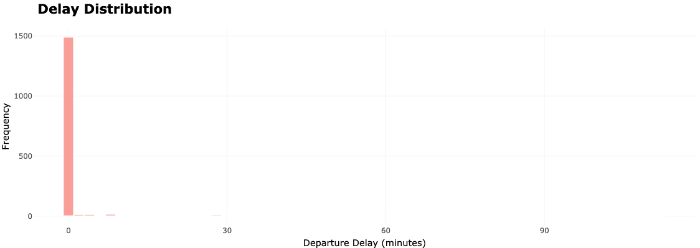
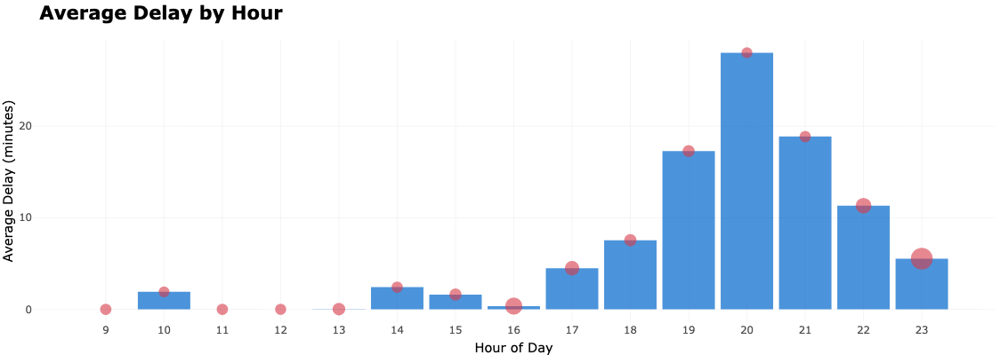
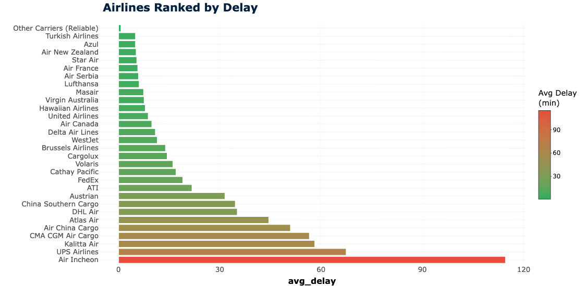
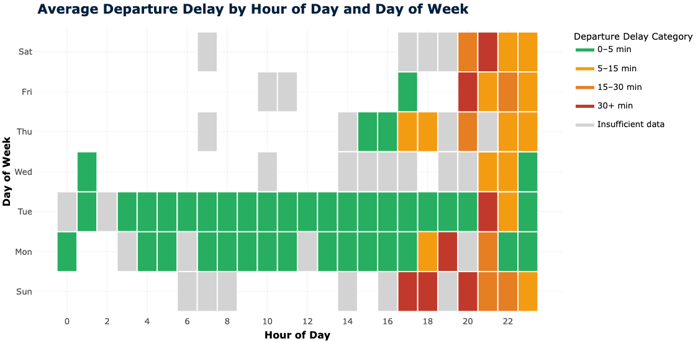
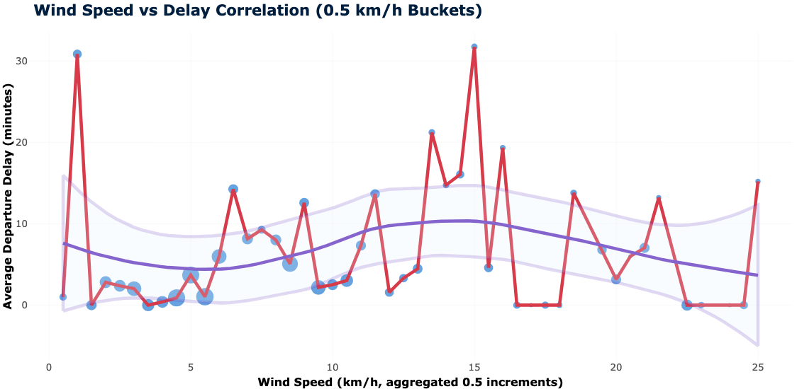
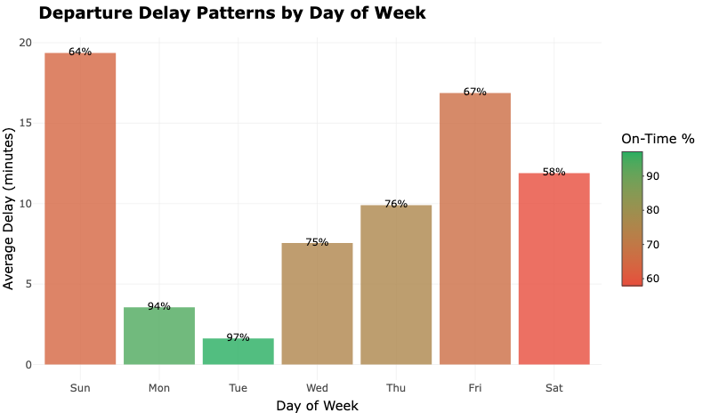

## Introduction

- **Goal:** Analyze and predict flight departure delays using real-world data
- **Why:** Delays cost time, money, and disrupt travel plans

---

## Data Source & Pipeline

- **API:** Purchased real flight and weather data ($50)
- **Dataset:** 1,800+ flights, 3+ features (airline, airports, wind, etc.)
- **Pipeline:** Automated fetch, clean, merge, and update (Python + R)

---

## Data Preparation & Cleaning

- **Data wrangling:** 
  - Removed incomplete/duplicate records
  - Engineered features (hour, day of week, wind buckets)
  - Limited extreme outliers for delay after 120 min
- **Integrity checks:** All predictions use the same schema as training

---

## Exploratory Data Analysis

### Delay Distribution

- Most flights are on time (0 min delay)
- Delays are right-skewed; a few flights experience significant delays

---

### Average Delay by Hour

- **Morning flights:** Minimal delays
- **Evening flights:** Delays spike after 17:00
- **Insight:** Booking earlier flights seems smarter
- Early bird gets the bird; night owl gets the terminal floor.

---

### Airline Performance

- **Finding:** Some carriers (Air Incheon, UPS) have much higher delays
- **Insight:** Choosing airlines with lower average delays is smarter

---

###

---

### Temporal Delay Patterns

- **Heatmap:** Average delay by hour and day of week
- **Green:** On-time, **Red:** Severe delays
- **Patterns:** Evenings and certain days are riskier
- **Note:** Colors represent historical averages, not causality

---

###

---

### Wind Speed vs Delay

- **Hypothesis:** Higher wind = more delays?
- **Finding:** No strong correlation; delays do not consistently increase with wind
- **Lesson:** Simple factors are not enough — we need multi-feature models

---

###

---

### Day of Week Analysis

---

## Machine Learning Model

- **Model:** Random Forest Regression (in progress)
- **Features:** Airline, departure/arrival airport, hour, day, wind speed
- **Target:** Departure delay (minutes)
- **Deployment:** It will predict delays for new flights in real time (future work)
- **Note:** Still being developed and tested. The dashboard shows predictions for today's flights.

---

## Interactive Dashboard

- **Built with:** R Shiny + Plotly
- **Live Metrics:** Updates as you filter by airline or hour
- **System Refresh:** Latest flight and weather data
- **Visual Exploration:** Tabs to compare airlines, graphs to spot risky hours, and more

---

## Lessons Learned

- **Real data is messy:** Cleaning and validation are important
- **Not all features matter:** Wind was a weak predictor
- **ML adds value:** Combining features gives better predictions

---

## Conclusion

- Purchased and processed live flight and weather data.
- You can actually use this to pick better airlines and avoid risky hours.
- The machine learning model is in progress.

---

## Thank you

Questions?
